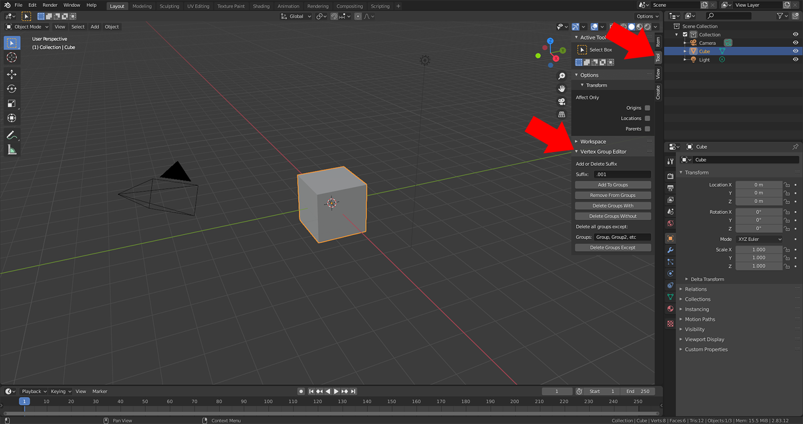

# Blender Vertex Group Editor
Add on for Blender that lets you easily edit vertex group names

## What It Does
This add on lets you manipulate the active object's vertex groups in the following ways:

* Add a specified suffix to all vertex group names.
* Delete a specified suffix from all vertex group names.
* Delete all vertex groups that end with a specified suffix.
* Delete all vertex groups that don't end with a specified suffix.
* Delete all vertex groups except those on a specified list.

## How To Use It
Download the vertex_group_editor.zip file and install it as an add on in Blender. (Edit > Preferences > Add Ons > Install)

After installing toggle the n-panel open and under the Tools tab you should see Vertex Group Editor.

If you want to manipulate a suffix, specify it in the text field (it's ".001" by default because my use case is for manipulating rigs that I'm combining or splitting, and this is Blender's default suffix when bones are duplicated). Suffixes are case-sensitive.

If you want to specify a list of vertex groups to keep, deleting all others, type them into the Groups text field. Group names can be separated by comma or white space. The group names you specify are not case sensitive.
